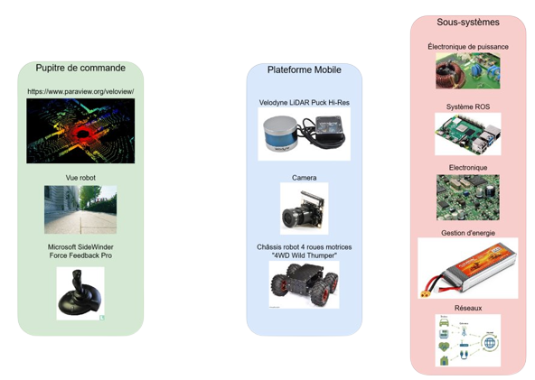

# Modelidar
> ***Projet MODELIDAR 2022 conception d'une plateforme motorisée et acquisition des données d'un LIDAR via ROS***

## Présentation générale du projet : 

Le projet de la première année à l’ENSEA vise à développer un ensemble de compétences nécessaires à l’aboutissement d’un projet. Celles-ci comptent des savoir managériaux (répartition des étapes, gestion des équipes…) et techniques (Conception, développement…). 

Pour notre groupe, le professeur encadrant (qui fait office de chef de projet) a opté pour une voiture télécommandée qui sera équipé d’un LIDAR (light detection and ranging). Ladite voiture devra, une fois achevée, permettre la modélisation 3D des espaces qu’elle parcourt. 

### Aspirations : 

Pour des raisons de contraintes temporelles, le projet sera exécuté par étapes. La première étape est d’établir un prototype fonctionnel qui repondera aux besoins basiques du cahier des charges. Les autres étapes seront des améliorations que nous pourrons apporter au produit pour en optimiser l’utilisation. Celles-ci seront d’aspect esthétique et fonctionnel.  

L’ultime aspiration serait une voiture radiocommandée, capable de scanner son environnement et de transmettre les données à une IHM. 

### Technologies et Hardware disponible : 

Les technologies mises à disposition par l’encadrant sont : 
- Un LIDAR : [Velodyne HI-RES Lidar](https://velodynelidar.com/products/puck-hi-res/) ;
- Le châssis d’une voiture télécommandée ;
- Un joystick : Techno Microsoft Sidewinder Precision Pro  ;
- 2 [RaspberryPi 4](https://www.raspberrypi.com/) ; 
- Une [caméra](https://wiki.keyestudio.com/SMP0079_KEYESTUDIO_Wide_Angle_Camera_Module_5_Million_Pixels_1080p_for_Raspberry_Pi ) faite exprès pour Raspberry ;
- [ROS](http://wiki.ros.org/) ;

## Outil ROS : 

L’outil Ros est l’une des technologies choisis pour le projet. Abréviation de Robot Operating System, ROS est un set de librairies et d’outils permettant de créer des applications dédiées pour le contrôle des robots. Sa force réside dans le fait qu’il se base sur une très grande communauté qui se développe continuellement. Cela va faire que son appréhension sera plus facile. D’autre part, l’outil Ros fera en sorte de centraliser l’envoie des données dans une borne commune, chose qui va rendre facile le traitement de cet aspect. 

On fut tous confié en priorité la tache d’étudier cet outil, et plus précisément l’outil Catkin. 
Nous avons donc suivi la procédure et le tutoriel disponible à [l'adresse suivante](http://wiki.ros.org/fr/ROS/Tutorials) 

Notre rôle était de concevoir des noeuds respectivement pour envoyer les données reçues par le joystick pour l'envoyer en réseau à la plateforme mobile et à la commande moteur et du coup un noeud de réception pour cela ; un noeud pour récupérer les données du LIDAR et les envoyer idéalement vers un écran (idéalement). Cependant nous avons rencontré un problème de compatibilité avec nos clés. Etant sur ROS Noetic, nous avions d'abord pensé à faire une installation type *debian* mais à cause de ce souci nous nous sommes finalement tournés vers la version 64bits de *buster* car notre protocole ne fonctionnait que pour cette version et que le nombre de paquet est plus important. 

Utilisation de la machine virtuelle ROS pour réaliser le tutoriel et comprendre comment articuler notre « architecture machine ». Comprendre comment former des nœuds leur envoyer des données et en récupérer est indispensable. Nous avons également cherché et trouvé le package ROS propre à notre LIDAR que nous pourrons implémenter à [cette adresse](https://www.generationrobots.com/blog/fr/integration-dun-lidar-avec-ros-exemples-de-projets/).  

Nous avons donc installé ROS sur plusieurs Raspberry tantôt à cause de crash (court-circuit nape caméra) tantôt parce qu'on avait, a minima, besoin de deux RaspberryPi. En suivant le tutoriel nous avons été jusqu'à la réalisation de la tortue. Elle sera par la suite contrôlée par les joysticks.

## Etude de puissance de la structure : 

L'objectif du projet était d'avoir une plateforme mobile qui puisse être pilotée plusieurs minutes (dizaines ?) et ce sans avoir besoin d'être reliée sur secteur. Nous avons donc pris la décision d'utiliser des batteries.

### Dimensionnement des batteries :

Pour dimensionner nos sources nous avons réalisé un bilan énergétique complet de la structure. 
- Le LIDAR utilisé possède une **gamme de tension d'utilisation entre 9.0V et 18.0V**. On peut lire sur la documentation une puissance de 36W liée à un surdimensionnement pour la charge, la **consommation réelle est autour de 8W**. On déduit que la **plage de courant entre 0.4A et 0.9A**
- Chaque moteur (*quatre au total*) a **6.0V pour tension nominale** et **5.0A de courant nominal**
- Le servomoteur possède une tension recommandée de **12.0V** et un courant de **0.65A** (finalement pas utilisé donc surdimensionnement de la batterie)
- La Raspberry est alimentée avec une tension de **5.1V** et un courant de **3.0A**

Au total nous avons besoin de **30.0A** à **7.4V** pour nous prévenir d'un quelconque échauffement nous préférons considérer un facteur 3 et donc prendre une batterie de **666W**

Nous avions également des contraintes mécaniques liées aux dimensions du panier sous notre chariot (6cmx12cmx3cm) ainsi nous avons choisi de prendre deux batteries [*Gens Ace 5000mAh 7.4V 2S2P 60C*](https://www.genstattu.com/2s-7-4v-lipo-battery.html?_bc_fsnf=1&Voltage%28V%29=7.4&Capacity+Range%28mAh%29=3000-5999 )

### Chargeur de batterie : 

Qui dit batterie rechargeable dit station de recharge. Nous avions dans notre laboratoire la station trouvable [ici](https://www.flashrc.com/graupner/4629-chargeur_ultra_trio_plus_14_12v_220v_graupner.html). 

Nonobstant, nos cables et nos connecteurs n'étaient pas adaptés à ceux du chargeur. Ce faisant nous avons dû démonter et dessouder les différentes pins pour en mettre de nouveaux. Il faut également réaliser de nouveaux câbles pour relier la batterie à la station. Pour se faire on soude aux câbles un pin supplémentaire. On réalise également un adaptateur pour veiller à éviter tout court-circuit et pouvoir brancher notre système à trois câbles sur n'importe quel port mais nous en parlerons dans une section suivante. 

